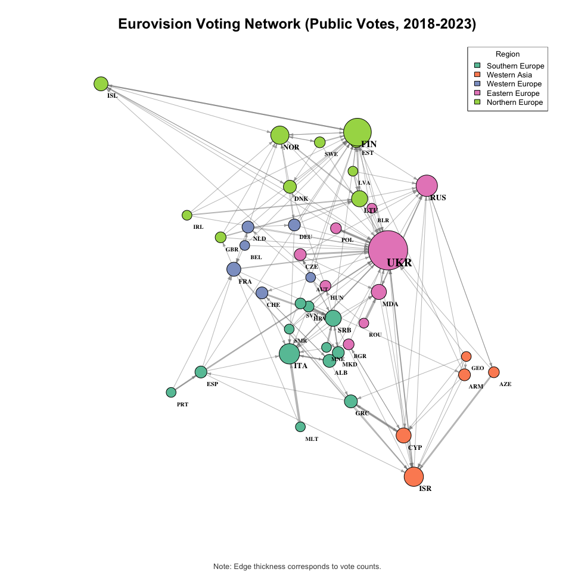
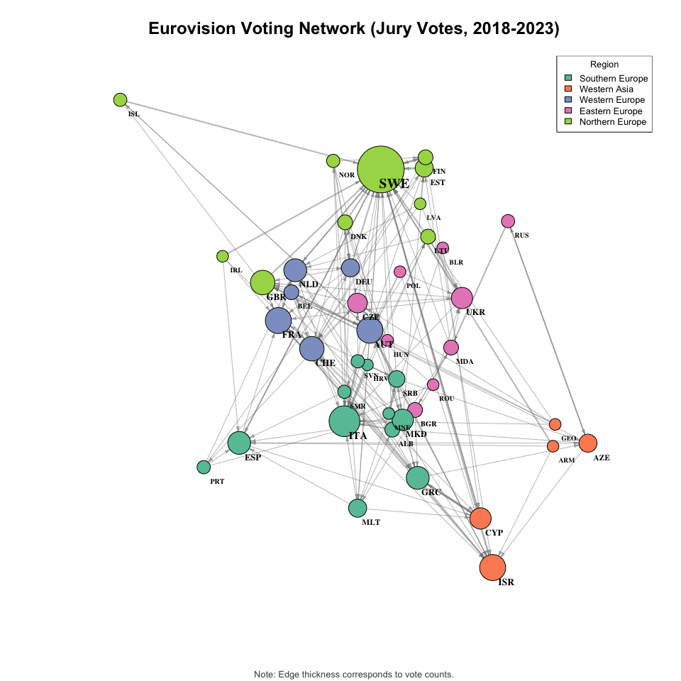
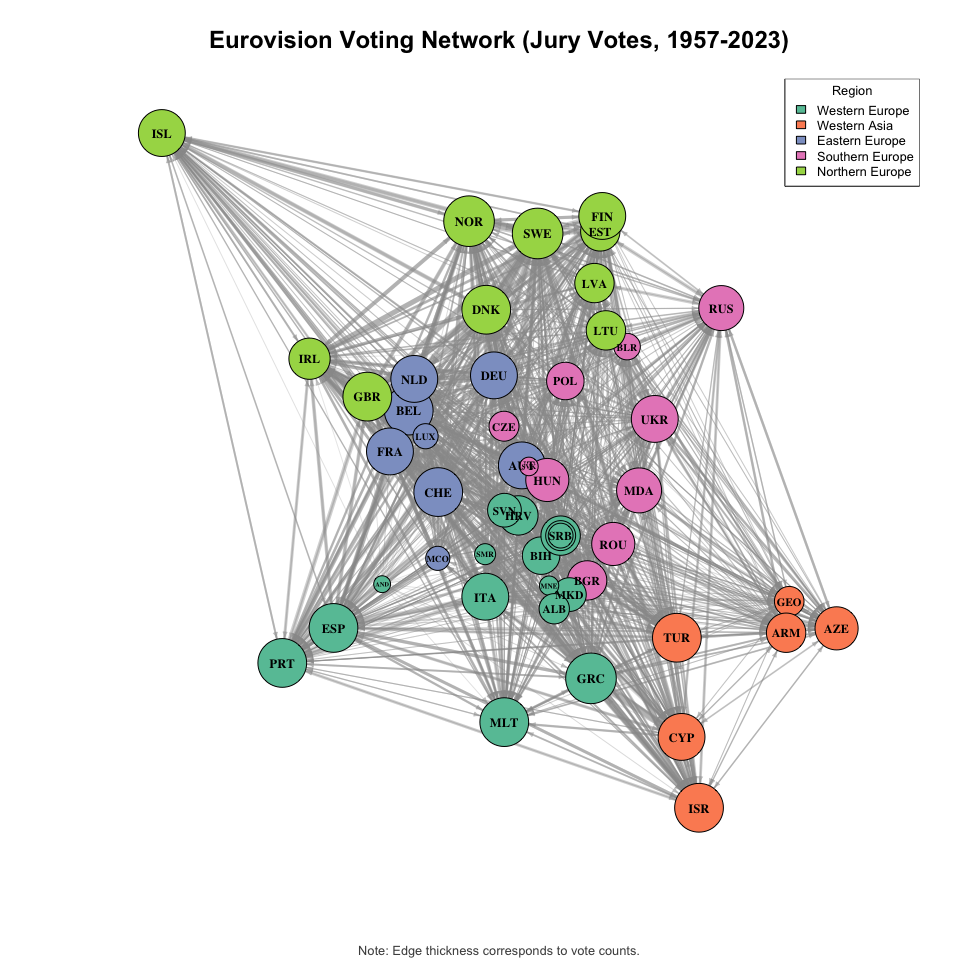
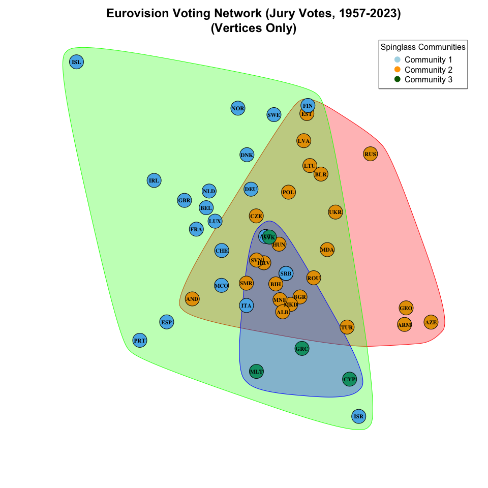
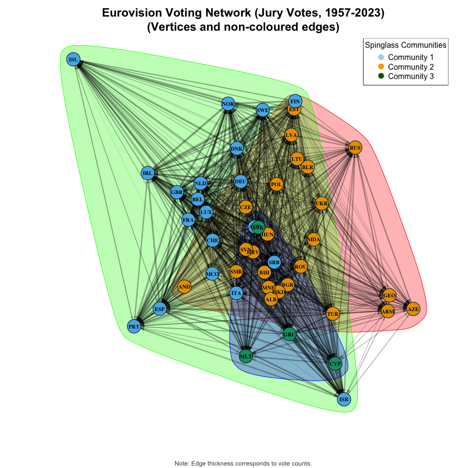
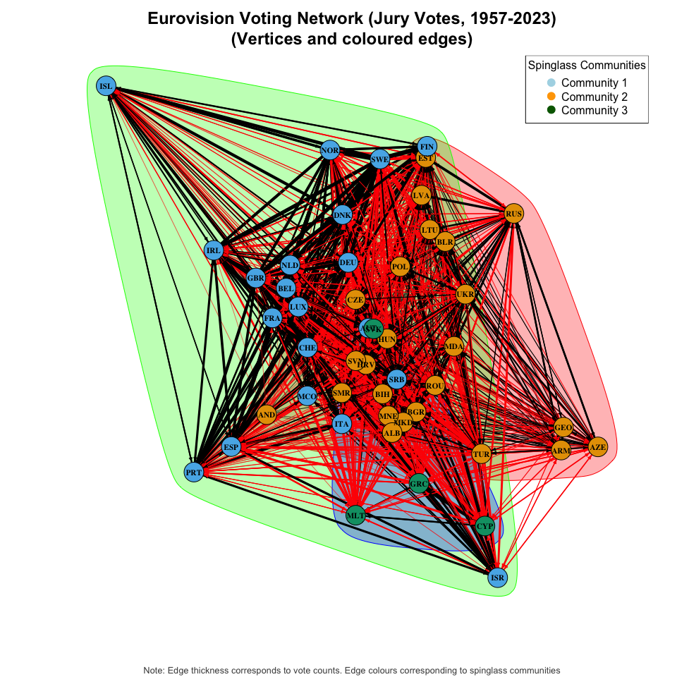

Eurovision Voting Network Analysis
================
Alexandra Dobre

For this project, we are going to use networks representing votes in the
[Eurovision Song
Contest](https://en.wikipedia.org/wiki/Eurovision_Song_Contest), which
were derived from a larger dataset, where it was posted by @datagraver,
presumably drawing from the live broadcasts or websites like
<https://eurovision.tv/> or <https://eurovisionworld.com/>.

**Some background information**:

The Eurovision Song Contest is an annual competition broadcast on live
television that has been running since 1956. Every year, each competing
(primarily) European country performs an original song performed live on
stage, followed immediately by a vote.

Countries award points to other countries (they cannot vote for
themselves), with each country giving 1-8, 10, and 12 points to their
top choices (12 points to top choice, 10 points to second, 8 to third, 7
to fourth, etc.). Since the mid-2000s, each country’s votes are
determined by a combination of a popular vote (members of the public in
each country can vote for multiple entries over SMS, the telephone, or
via an app) and the votes of a jury comprised of five “experts”
(typically, people from the music industry). The public and jury votes
contribute equally. In the final, each country announces the points they
are awarding and special attention is given to the top points (the
“douze points”).

In this project, I consider three networks, all based on votes only in
the final. Two will consider just the last five competitions (2018 (won
by [Israel](https://youtu.be/84LBjXaeKk4)), 2019 (won by the
[Netherlands](https://youtu.be/R3D-r4ogr7s)), 2021 (won by
[Italy](https://youtu.be/RVH5dn1cxAQ)), 2022 (won by
[Ukraine](https://youtu.be/F1fl60ypdLs)), and 2023 (won by
[Sweden](https://youtu.be/BE2Fj0W4jP4?feature=shared))), and one will
consider the period from 1957 to 2023 (in the first year, 1956, votes
were not announced live as part of the broadcast). Countries and
entrants have changed over this period. For example, this dataset
includes Yugoslavia, which appeared in Eurovision on and off between
1975 and 1992, and then “Serbia & Montenegro”, which appeared between
2004 and 2006, followed by Serbia and Montenegro as independent entrants
since 2007.

**The data**:

- **euro_jury_count_18-23.csv** and **euro_televoting_count_18-23.csv**:
  these represent the number of times the country in the first column
  awarded its top points to the country in the second column within the
  period 2018 - 2023, based on either the jury or public vote. So, e.g.,
  we can see that the Albanian public selected Greece once and Italy
  twice as its top choice in that period.
- **euro_sum_jury_points.csv**: this represents the sum total of jury
  points awarded by the country in the first column to the country in
  the second column within the period 1957 - 2023. So, e.g., the first
  line records that the Austrian jury has awarded Albania a total of 23
  points between 1957 and 2023.
- **meta_eurovision.csv** contains some basic information on each of the
  competing countries (minus some outlier entries, like Australia and
  Morocco, and including some countries which no longer exist but
  competed in Eurovision in the past, such as Yugoslavia). It has the
  following columns:
  - Country: the name of the country
  - ISO.alpha3.code: a three letter code for each country (See more
    [here](https://unstats.un.org/unsd/methodology/m49/))
  - M49.code: another standard coding for each country (Again, see more
    [here](https://unstats.un.org/unsd/methodology/m49/))
  - Region: the primary region that the country is located in. (See more
    [here](https://statisticstimes.com/geography/countries-by-continents.php))
  - GDP.per.capita: the gross domestic product per capita in US dollars,
    taken from
    [here](https://data.worldbank.org/indicator/NY.GDP.MKTP.CD) and
    averaged from 2016 - 2021
  - Population2010.OECD.estimate: the population of each country, as
    reported on Wikipedia
    [here](https://en.wikipedia.org/wiki/List_of_countries_by_population_in_2010)
  - Area.sqkm: The land area of each country, in square kilometres, per
    Wikipedia as above
  - centroid.lon: The longitude in decimal degrees of the geographical
    centre of the country, as given by the CoordinateClear R package
    (from which the subsequent variables also derive)
  - centroid.lat: The latitude in decimal degrees of the geographical
    centre of the country
  - capital: The capital of the country
  - capital.lon: The longitude in decimal degrees of the capital of the
    country
  - capital.lat: The latitude of the capital of the country

Credit goes to the course convener for MY461: Social Network Analysis
for compiling these datasets.

**Below, we construct 3 networks**:

1.  `net_5pub`: A network representing the public, popular vote in the
    last five competitions, with an edge attribute representing the
    count of times the voting public from Country A selected Country B
    as their top song in those five competitions.
2.  `net_5jury`: A network representing the jury vote in the last five
    competitions, with an edge attribute representing the count of times
    the jurors from Country A selected Country B as their top song in
    those five competitions.
3.  `net_alljury`: A network representing jury votes between 1957 to
    2023, with an edge attribute representing the sum of all of the
    points awarded by the jurors of Country A to Country B in those
    years.

``` r
require(dplyr)
require(igraph)

rm(list=ls()) 

#setwd("")

# Code to generate the networks:

meta <- read.csv("meta_eurovision.csv", header=TRUE, as.is=TRUE, stringsAsFactors=FALSE)
euro_5pub <- read.csv("euro_public_count_18-23.csv", header=TRUE, as.is=TRUE, stringsAsFactors=FALSE)
euro_5jury <- read.csv("euro_jury_count_18-23.csv", header=TRUE, as.is=TRUE, stringsAsFactors=FALSE)

net_5pub <- graph_from_data_frame(euro_5pub, directed=TRUE)
net_5jury <- graph_from_data_frame(euro_5jury, directed=TRUE)

## Creating a new dataframe to which we can append the metadata, 
## appropriately aligned with the order of the nodes in the networks
last5_df <- data.frame(Country = V(net_5pub)$name) 
last5_df <- merge(last5_df, meta, by="Country", sort=FALSE)

## Again creating the networks, 
## this time adding all node attributes through the "vertices" element 
net_5pub <- graph_from_data_frame(euro_5pub, vertices = last5_df)
net_5jury <- graph_from_data_frame(euro_5jury, vertices = last5_df)

## As above, now for the 1957-2023 jury network
euro_alljury <- read.csv("euro_sum_jury_points.csv", header=TRUE, as.is=TRUE, stringsAsFactors=FALSE)
net_alljury <- graph_from_data_frame(euro_alljury)
alljury_df <- data.frame(Country = V(net_alljury)$name)
alljury_df <- merge(alljury_df, meta, by ="Country", sort=FALSE)
net_alljury <- graph_from_data_frame(euro_alljury, vertices = alljury_df)
```

### Network Visualization and Analysis

To gain initial insights into the Eurovision voting patterns, I
visualized three distinct social networks: `net_5pub` (public votes,
2018-2023), `net_5jury` (jury votes, 2018-2023), and `net_alljury` (all
jury votes, 1957-2023).

- **Edge Weights:** I emphasized the voting strength by sizing edges
  based on the “Count” variable for the recent public and jury networks
  (`net_5pub`, `net_5jury`), and the “Sum” variable for the
  comprehensive historical jury network (`net_alljury`).
- **Node Sizing:** Node sizes were determined by in-strength centrality
  (calculated using `strength()`, and using the respective “Count” or
  “Sum” edge attribute as weight), providing a visual representation of
  each country’s received voting influence.
- **Node Coloring & Positioning:** For geographical context and regional
  patterns, nodes were colored by their respective `Region` variable.
  Their positions were precisely mapped using the latitude and longitude
  of their capital cities
  (`layout = as.matrix(cbind(V(your_network)$capital.lon, V(your_network)$capital.lat))`),
  ensuring that the plots were not only informative but also
  geographically intuitive.

First, I present the visualization of `net_5pub`, representing the
public Eurovision votes from 2018-2023:

``` r
library(scales)
library(RColorBrewer)

# Get unique regions
regions <- unique(V(net_5pub)$Region)

# Get a single, consistent region list
all_regions <- unique(c(V(net_5pub)$Region, V(net_5pub)$Region))

# Assign colors once based on all possible regions
palette <- brewer.pal(min(length(all_regions), 8), "Set2")
region_colors <- setNames(palette, all_regions)
V(net_5pub)$color <- region_colors[V(net_5pub)$Region]

# Compute node sizes based on in-strength centrality
size.of.vertices <- rescale(strength(net_5pub, mode = "in"), to = c(5, 20))

# Plot the network
plot(net_5pub,
     vertex.label=V(net_5pub)$ISO.alpha3.code,
    vertex.label.cex = rescale(strength(net_5pub, mode="in"), to=c(0.6, 1.2)),
    vertex.label.color = "black",  
     vertex.label.font = 2,
     vertex.size = size.of.vertices,  # Scale node sizes
     vertex.label.dist = 1.15,
    vertex.label.degree = pi/4,
     vertex.color = V(net_5pub)$color,  # Color nodes by Region
     edge.color = adjustcolor("gray50", alpha.f=0.5),
     edge.width = c(1, 2, 3, 4)[E(net_5pub)$Count],  # Scale edges
     edge.arrow.size = 0.35,
     layout = as.matrix(cbind(V(net_5pub)$capital.lon, V(net_5pub)$capital.lat)))

# title
title(main = "Eurovision Voting Network (Public Votes, 2018-2023)", cex.main = 1.5, col.main = "black", font.main = 2)

# Add legend
legend("topright", legend = regions, fill = region_colors, title = "Region", 
       border = "black", bty = "o", cex = 0.8)

# Add note about edge thickness
mtext("Note: Edge thickness corresponds to vote counts.", side = 1, line = 4, cex = 0.8, col = "gray30")
```

<!-- -->

Next, we’ll plot the jury votes from the last five years.

``` r
# Get unique regions
regions <- unique(V(net_5jury)$Region)
V(net_5jury)$color <- region_colors[V(net_5jury)$Region]

# Compute node sizes based on in-strength centrality
size.of.vertices <- rescale(strength(net_5jury, mode = "in"), to = c(5, 20))

# Plot the network
plot(net_5jury,
     vertex.label=V(net_5jury)$ISO.alpha3.code,
    vertex.label.cex = rescale(strength(net_5jury, mode="in"), to=c(0.6, 1.2)),
    vertex.label.color = "black",  
     vertex.label.font = 2,
     vertex.size = size.of.vertices,  
     vertex.label.dist = 1.15,
    vertex.label.degree = pi/4,
     vertex.color = V(net_5jury)$color,  
     edge.color = adjustcolor("gray50", alpha.f=0.5),
     edge.width = c(1, 2, 3, 4)[E(net_5jury)$Count],  
     edge.arrow.size = 0.35,
     layout = as.matrix(cbind(V(net_5jury)$capital.lon, V(net_5jury)$capital.lat)))

# title
title(main = "Eurovision Voting Network (Jury Votes, 2018-2023)", 
      cex.main = 1.5, 
      col.main = "black", 
      font.main = 2)

# Add legend
legend("topright", 
       legend = regions, 
       fill = region_colors, 
       title = "Region", 
       border = "black", 
       bty = "o", 
       cex = 0.8)

# Add note about edge thickness
mtext("Note: Edge thickness corresponds to vote counts.", side = 1, line = 4, cex = 0.8, col = "gray30")
```

<!-- -->

Finally, we’ll plot all historical jury votes from 1957-2023.

``` r
library(scales)

# 1. Calculate strengths on net_alljury
str_in <- strength(net_alljury, mode = "in")

# 2. Piecewise scaling (below 40 vs. 40–49)
vertex_sizes <- ifelse(
  str_in < 40,
  rescale(str_in, to = c(5, 10)),  # small range for <40
  rescale(str_in, to = c(10, 15), from = c(40, 49))  # bigger range for 40..49
)

# 3. Edge widths
E(net_alljury)$width <- rescale(E(net_alljury)$Sum, to = c(0.5, 8))

# 4. Regions
regions <- unique(V(net_alljury)$Region)
V(net_alljury)$color <- region_colors[V(net_alljury)$Region]

# 5. Plot net_alljury with those sizes
plot(
  net_alljury,
  vertex.label        = V(net_alljury)$ISO.alpha3.code,
  vertex.label.cex    = rescale(str_in, to = c(0.4, 0.8)),
  vertex.label.color = "black", 
  vertex.label.font = 2,
  vertex.label.degree = pi/4,
  vertex.size         = vertex_sizes,
  vertex.color        = V(net_alljury)$color,
  edge.width          = E(net_alljury)$width,
  edge.color          = adjustcolor("gray60", alpha.f = 0.4),
  edge.arrow.size     = 0.35,
  layout = cbind(V(net_alljury)$capital.lon, V(net_alljury)$capital.lat)
)

# title
title(main = "Eurovision Voting Network (Jury Votes, 1957-2023)", cex.main = 1.5, col.main = "black", font.main = 2)

# Add legend
legend("topright", legend = regions, fill = region_colors, title = "Region", 
       border = "black", bty = "o", cex = 0.8)

# Add note about edge thickness
mtext("Note: Edge thickness corresponds to vote counts.", side = 1, line = 4, cex = 0.8, col = "gray30")
```

<!-- -->

#### In this section, I calculate various network metrics like reciprocity, (global) transitivity, and assortativity by Region for the 2018-2023 popular and jury networks (`net_5pub` and `net_5jury`) and interpret the results.

**Reciprocity**

``` r
# Calculate Reciprocity
rec_5pub <- reciprocity(net_5pub)
rec_5jury <- reciprocity(net_5jury)

# Calculate Global Transitivity
trans_5pub <- transitivity(net_5pub, type = "global")
trans_5jury <- transitivity(net_5jury, type = "global")

# Calculate Assortativity by Region
# Make sure Region is a factor for assortativity_nominal
# Assuming V(net_5pub)$Region and V(net_5jury)$Region exist and are correctly populated
assort_5pub <- assortativity_nominal(net_5pub, factor(V(net_5pub)$Region))
assort_5jury <- assortativity_nominal(net_5jury, factor(V(net_5jury)$Region))

# Create a data frame for the results
network_measures_df <- tibble::tribble(
  ~Measure, ~`Public Vote Net.`, ~`Jury Vote Net.`,
  "Reciprocity", rec_5pub, rec_5jury,
  "Global Transitivity", trans_5pub, trans_5jury,
  "Assortativity by Region", assort_5pub, assort_5jury
)

# Render the data frame as a Markdown table
knitr::kable(network_measures_df, align = c('l', 'c', 'c'))
```

| Measure                 | Public Vote Net. | Jury Vote Net. |
|:------------------------|:----------------:|:--------------:|
| Reciprocity             |    0.2312925     |   0.1750000    |
| Global Transitivity     |    0.2968750     |   0.1916462    |
| Assortativity by Region |    0.3367126     |   0.0919952    |

We first compare the 2018-2023 Eurovision public and jury voting
networks by analysing reciprocity, which measures the proportion of
mutual voting relationships. Reciprocity in the public vote (23.1%) than
in the jury vote (17.5%), suggesting that countries are more likely to
return public votes when they receive them. The jury vote, on the other
hand, has lower reciprocity, likely due to the fact that voting is
expected to be based primarily on vocal ability and song quality.

Next, we examine global transitivity to identify clustering in the
networks. The public network has a clustering coefficient of 0.3,
meaning that if Country A votes for both Country B and C, there is a 30%
chance that Country B also votes for Country C. In the jury network,
this probability drops to 19.2%, suggesting there are regional voting
patterns and alliances are more at play in the public voting network.

Finally, we consider assortativity to measure regional homophily, where
values closer to 1 indicate stronger within-region voting patterns. We
see stronger regional homophily among the public vote (0.34) than the
jury vote (0.09), though the effect is moderate, indicating other other
factors beyond regional ties may also play a role in voting patterns.

The above findings suggest that public voting is influenced by
reciprocal voting, voting blocs/alliances, and regional ties. The jury
vote, however, is less influenced by these factors, suggesting a greater
emphasis on other factors, such as musical quality. However, there are
several factors to consider while interpreting these results. First, the
analysis is limited to the 2018-2023 period, meaning it doesn’t capture
long-term voting trends. Notably, the Russian invasion of Ukraine may
have influenced voting patterns in ways unique to previous years.
Second, we only measue assortativity by region, but voting may also be
influenced by language, diaspora ties, or other cultural connections.
And third, we lack data on musical ability, which could provide deeper
insight into jury voting patterns as it is intended to be based on
technical musical quality.

Finally, we focus on recent Eurovision contests rather than the full
1957-2023 period due to changes in Eurovision’s voting systems and
country composition over time. In addition, a historical network
spanning decades would likely be too dense and well-connected to provide
any meaningful results, as nearly every country would have had the
opportunity to vote for every other country at some point in time. In
conclusion, this aggregated network would be mixing different voting
systems, political eras, and changing participation, making network
measures harder to interpret meaningfully.

### Community Detection and Visualization of Historical Voting Patterns

To uncover latent groupings and alliances within the long-term
Eurovision voting behavior, I applied the **Spinglass community
detection algorithm** to the comprehensive 1957-2023 jury voting network
(`net_alljury`). In this analysis, the “Sum” attribute was used as an
edge weight to accurately reflect the accumulated voting strength
between countries, guiding the community detection process. To ensure
reproducibility of the community assignment, `set.seed(4321)` was set
immediately prior to running the `cluster_spinglass()` function.

For enhanced clarity in visualizing the complex community structures
identified, I generated three successive plots, each progressively
revealing more detail about the network’s organization:

1.  **Geographical Node Distribution:** The initial plot displayed only
    the nodes, positioned geographically using the latitude and
    longitude of each country’s capital. This foundational visualization
    provided a clear geographical layout of the participating countries
    and allowed for an initial assessment of the assigned communities.
2.  **Basic Connectivity Overview:** In the second plot, edges were
    introduced in a single, uniform color. This step highlighted the
    presence and density of connections between countries, providing a
    view of the network’s overall structure without the visual
    distraction of varied edge colors.
3.  **Community-Based Network Structure:** The final and most
    informative plot colored both the nodes and their corresponding
    edges based on the detected Spinglass community membership. This
    comprehensive visualization effectively illuminated how distinct
    communities are formed and interconnected within the historical
    Eurovision jury voting network.

``` r
set.seed(4321)
sg <- cluster_spinglass(net_alljury, weights = E(net_alljury)$Sum)

num_comms <- length(unique(membership(sg)))  # number of communities detected
community_colors <- brewer.pal(n = num_comms, name = "Set3")
V(net_alljury)$color <- community_colors[membership(sg)]

plot(sg,
     net_alljury,
     vertex.label=V(net_alljury)$ISO.alpha3.code,
     vertex.label.cex=.7,
     vertex.size = 8,
     vertex.color=V(net_alljury)$color,
     vertex.label.color = "black",  
     edge.width=0,
     vertex.label.font = 2,
     #vertex.label.dist = 1.1,
     #vertex.label.degree = pi/4, 
     edge.arrow.size = 0,
     layout = as.matrix(cbind(V(net_alljury)$capital.lon, V(net_alljury)$capital.lat)))

title(main = "Eurovision Voting Network (Jury Votes, 1957-2023)\n(Vertices Only)",
      cex.main = 1.5,
      col.main = "black",
      font.main = 2)


legend(
  "topright",
  legend = c("Community 1", "Community 2", "Community 3"),
  col    = c("lightblue", "orange", "darkgreen"),  # Match your actual node colors
  pch    = 19,   # Solid circle
  pt.cex = 1.5,  # Size of the legend dots
  bty    = "o"  ,
  title  = "Spinglass Communities"
)
```

<!-- -->

``` r
library(RColorBrewer)

set.seed(4321)
sg <- cluster_spinglass(net_alljury, weights = E(net_alljury)$Sum)

plot(sg,
     net_alljury,
     vertex.label=V(net_alljury)$ISO.alpha3.code,
     vertex.label.cex=.7,
     vertex.size = 8,
     vertex.color= V(net_alljury)$color,
     vertex.label.color = "black",  
     edge.width=E(net_alljury)$weight,
     edge.color = adjustcolor("black", alpha.f=0.2),
     vertex.label.font = 2,
      mark.groups = communities(sg),
     #vertex.label.dist = 1.1,
     #vertex.label.degree = pi/4, 
     edge.arrow.size = 0.35,
     layout = as.matrix(cbind(V(net_alljury)$capital.lon, V(net_alljury)$capital.lat))
     )

title(main = "Eurovision Voting Network (Jury Votes, 1957-2023)\n(Vertices and non-coloured edges)",
      cex.main = 1.5,
      col.main = "black",
      font.main = 2)


legend(
  "topright",
  legend = c("Community 1", "Community 2", "Community 3"),
  col    = c("lightblue", "orange", "darkgreen"),  # Match your actual node colors
  pch    = 19,   # Solid circle
  pt.cex = 1.5,  # Size of the legend dots
  bty    = "o"  ,
  title  = "Spinglass Communities"
)

# Add note about edge thickness
mtext("Note: Edge thickness corresponds to vote counts.", side = 1, line = 4, cex = 0.8, col = "gray30")
```

<!-- -->

``` r
set.seed(4321)
sg <- cluster_spinglass(net_alljury, weights = E(net_alljury)$Sum)

plot(sg,
     net_alljury,
     vertex.label=V(net_alljury)$ISO.alpha3.code,
     vertex.label.cex=.7,
     vertex.size = 8,
     vertex.color= V(net_alljury)$color,
     vertex.label.color = "black",  
     edge.width=E(net_alljury)$weight,
     vertex.label.font = 2,
    mark.groups = communities(sg),
     #vertex.label.dist = 1.1,
     #vertex.label.degree = pi/4, 
     edge.arrow.size = 0.35,
     layout = as.matrix(cbind(V(net_alljury)$capital.lon, V(net_alljury)$capital.lat))
     )

title(main = "Eurovision Voting Network (Jury Votes, 1957-2023)\n(Vertices and coloured edges)",
      cex.main = 1.5,
      col.main = "black",
      font.main = 2)

legend(
  "topright",
  legend = c("Community 1", "Community 2", "Community 3"),
  col    = c("lightblue", "orange", "darkgreen"),  # Match your actual node colors
  pch    = 19,   # Solid circle
  pt.cex = 1.5,  # Size of the legend dots
  bty    = "o"  ,
  title  = "Spinglass Communities"
)

# Add note about edge thickness
mtext("Note: Edge thickness corresponds to vote counts. Edge colours corresponding to spinglass communities", side = 1, line = 4, cex = 0.8, col = "gray30")
```

<!-- -->

### Discussion of Community Structures and Voting Patterns

The analysis of the 1957-2023 jury voting network using the Spinglass
community detection algorithm yielded insightful patterns regarding
country alliances. While the data inherently represents countries across
five defined geographical regions, the Spinglass algorithm strikingly
identified only three primary communities.

Upon comparing these algorithmically-derived community memberships with
the predefined geographical `Region` attribute, some expected overlap
was observed. For instance, Nordic countries consistently grouped into
the same Spinglass community, and earlier visualizations indeed depicted
strong voting ties (thick edges) among them. However, the overall
community structure presented a more complex picture. Many countries
demonstrated strong voting ties with nations from different official
geographical regions, clearly indicating that simple geographical
proximity or regional categorization alone is insufficient to explain
these intricate voting patterns.

Instead, the observed community formations likely reflect deeper, more
nuanced connections, such as shared cultural ties, historical alliances,
and the presence of diaspora communities. These factors appear to
transcend traditional regional boundaries, creating a rich tapestry of
inter-country relationships that manifest in Eurovision voting.

The disparity between the five geographical regions and the three large
communities discovered by the Spinglass algorithm underscores a key
finding: Eurovision voting alliances are not merely a reflection of a
geographical map. The emergence of fewer, larger communities suggests
that broader cultural and historical affinities play a significant role
in shaping voting behaviors. These clusters offer a compelling glimpse
into the underlying social and cultural dynamics among participating
nations.

To further deepen this understanding, future analyses could investigate
the temporal stability of these community structures, assessing whether
they evolve or remain constant amidst shifting cultural or political
landscapes. Additionally, exploring the interaction of other external
factors, such as economic ties or broader historical alliances, with the
observed voting patterns could provide a more comprehensive explanation
of the detected community formations.
